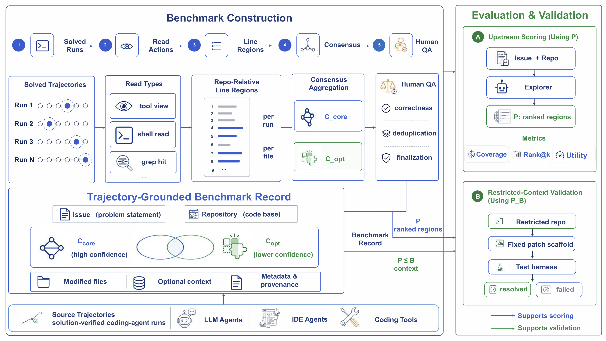
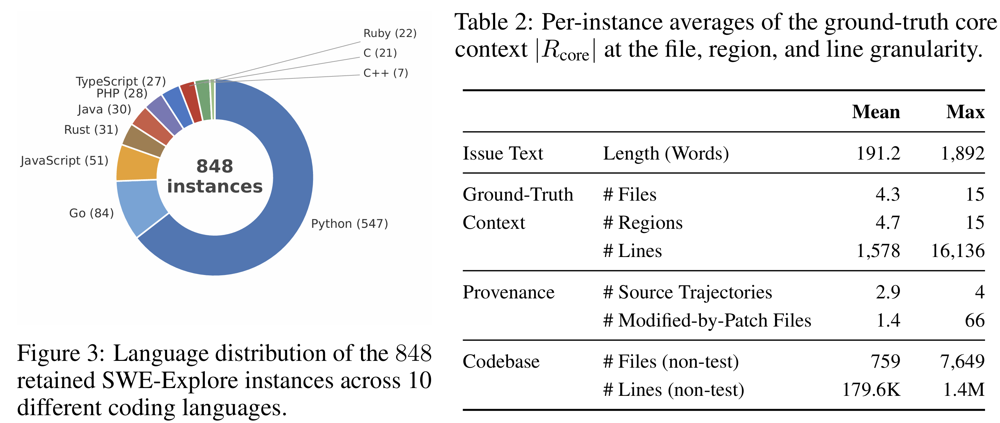
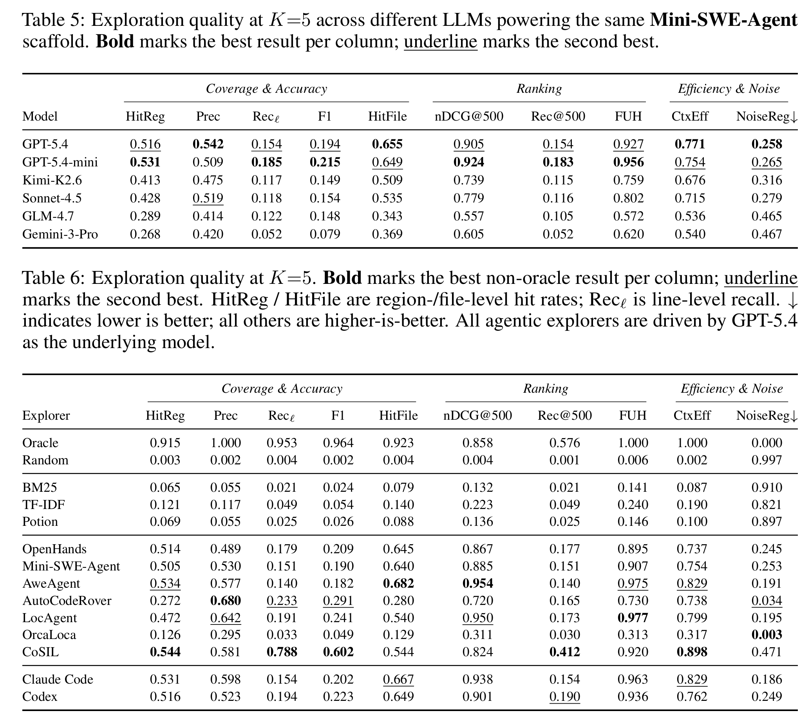

# SWE-Explore: Benchmarking How Coding Agents Explore Repositories


<p align="center">
  <a href="https://arxiv.org/abs/2606.07297"></a>
  <a href="https://huggingface.co/datasets/SWE-Explore-Bench/SWE-Explore-Bench"></a>
  <a href="https://github.com/Qiushao-E/SWE-Explore-Bench"></a>
  
  <a href="LICENSE"></a>
</p>

SWE-Explore-Bench is a trajectory-grounded benchmark for evaluating how well coding agents **explore, localize, and rank repository context** before editing code. Given a real issue and a repository snapshot, an explorer returns a ranked list of source files and line ranges. SWE-Explore scores those regions against line-level ground truth distilled from successful repair trajectories.

<p align="center">
  
</p>

## News

- **2026-06-08**: Paper, code, and dataset released.

## Links

| Resource | Link |
| --- | --- |
| Paper | [arXiv:2606.07297](https://arxiv.org/abs/2606.07297) |
| Dataset | [SWE-Explore-Bench/SWE-Explore-Bench](https://huggingface.co/datasets/SWE-Explore-Bench/SWE-Explore-Bench) |
| Code | [Qiushao-E/SWE-Explore-Bench](https://github.com/Qiushao-E/SWE-Explore-Bench) |

## Why SWE-Explore?

Repository-level coding benchmarks usually evaluate the whole repair pipeline with a final resolved/unresolved signal. That is useful, but it hides whether an agent actually found the right context. SWE-Explore isolates the exploration stage:

- **Direct exploration evaluation**: evaluate the code regions an agent reads or returns, before any patch is generated.
- **Trajectory-grounded labels**: derive core and optional context from independent successful repair trajectories.
- **Line-level supervision**: score files, regions, and ranked line budgets instead of coarse file-only localization.
- **Repair-aware validation**: connect upstream exploration scores with restricted-context downstream patch validation.
- **Broad agent coverage**: compare classical retrievers, general coding agents, IDE agents, and specialized localizers under one interface.

<p align="center">
  
</p>

## Benchmark Overview

SWE-Explore constructs a benchmark record from multiple solved trajectories for the same issue. It extracts read actions, converts them into repository-relative line regions, aggregates consensus core context, keeps model-specific optional context, and evaluates ranked explorer outputs with coverage, ranking, efficiency, and downstream validation metrics.

<p align="center">
  
</p>

## Dataset

The released dataset contains **848 issues** across **203 open-source repositories** and **10 programming languages**. Each instance includes the issue, repository snapshot metadata, line-level core and optional ground truth, read-step provenance, and benchmark metadata.

<p align="center">
  
</p>

## Instance Anatomy

Each benchmark instance asks an explorer to inspect a repository snapshot for one issue and return ranked regions:

<p align="center">
  
</p>

## Main Results

SWE-Explore evaluates exploration quality at a fixed ranked-region budget. The paper reports that agentic explorers form a clear tier above classical retrieval, while line-level coverage and efficient ranking remain challenging even when file-level hits are strong. The table below mirrors the paper results; the explorer wrappers currently registered in this repository are listed in the Quick Start section.

<p align="center">
  
</p>

## Quick Start

### 1. Install

```bash
uv sync
```

Requirements:

- Python 3.12+
- `uv` for environment management
- An OpenAI-compatible endpoint for LLM line refinement or agent explorers
- Optional external CLIs/SDKs for agent explorers such as Claude Code, Cursor, AutoCodeRover, CoSIL, LocAgent, OrcaLoca, Mini-SWE-Agent, and AweAgent

### 2. Download the benchmark

Load the released benchmark from Hugging Face:

```python
from datasets import load_dataset

ds = load_dataset("SWE-Explore-Bench/SWE-Explore-Bench", split="train")
ds.to_json("bench.final.mixcap.jsonl")
```

Or download the files directly:

```bash
huggingface-cli download SWE-Explore-Bench/SWE-Explore-Bench \
  --repo-type dataset \
  --local-dir data/SWE-Explore-Bench
```

### 3. Fetch repository snapshots

The evaluation code expects local repository snapshots under `repos/`. The helper downloads repositories at each trajectory's `base_commit` via the GitHub archive API, avoiding `.git` directories.

```bash
# Build instance_id -> base_commit map.
uv run python build_commit_map.py build -o commit_map.json

# Fetch repositories referenced by unified trajectories.
uv run python fetch_repos.py clone \
  --trajs-dir unify_trajs \
  --commit-map commit_map.json \
  --repos-dir repos

# Optional: inspect the repo/commit list without downloading.
uv run python fetch_repos.py list-repos \
  --trajs-dir unify_trajs \
  --commit-map commit_map.json
```

### 4. Run an explorer

`eval_runner.py` runs registered explorers over a benchmark file, supports resume, and can evaluate multiple `top_k` budgets.

```bash
uv run python eval_runner.py \
  --bench bench.final.mixcap.jsonl \
  --repos repos \
  --issue-map issue_map.json \
  --explorers bm25 tfidf claude_code \
  --top-k 5 \
  --output "results/{explorer}/top{k}.jsonl" \
  --workers 8 \
  --resume
```

`--issue-map` is optional when the benchmark file already contains `problem_statement`; otherwise it can provide `{instance_id: issue_text}`.

Available explorers include:

| Family | Explorers |
| --- | --- |
| Local retrieval | `bm25`, `tfidf`, `potion`, `rag`, `embed`, `swerank` |
| Simple baselines | `oracle`, `random`, `simple_rule` |
| Agentic CLIs | `claude_code`, `cursor` |
| Academic agents | `autocr`, `cosil`, `locagent`, `orcaloca`, `mini_swe_agent`, `awe_agent` |

Agent explorers can be routed through one OpenAI-compatible endpoint with `--academic-api-base`, `--academic-api-key`, and `--academic-model`; see `.env.example` and `configs/litellm_proxy.yaml`.

## Build the Benchmark From Trajectories

If you want to reconstruct the benchmark from raw or unified trajectories:

```bash
uv run python bench_build.py build \
  --trajs-dir unify_trajs \
  --output bench.jsonl \
  --repos repos \
  --model MODEL_REGEX \
  --instance-filter INSTANCE_REGEX \
  --repo-filter REPO_REGEX \
  --min-trajectories 3
```

Optional LLM refinement can tighten coarse read spans into line-level regions:

```bash
# Dry-run cost estimate.
uv run python line_refine.py refine bench.jsonl repos --dry-run -k 4

# Real refinement.
uv run python line_refine.py refine bench.jsonl repos \
  --output bench.refined.jsonl \
  --context-k 4
```

The builder detects file reads from:

1. `str_replace_editor` calls with `command="view"`
2. shell reads such as `cat`, `head`, `tail`, `grep`, and `sed -n`
3. fenced bash blocks containing the same read commands

## Benchmark Format

Each line in the benchmark JSONL is one instance:

```json
{
  "instance_id": "lincolnloop__goodconf-49",
  "repo_path": "/testbed",
  "repo_dir": "repos/goodconf",
  "ground_truth": {
    "read_core_files": ["goodconf/__init__.py", "pyproject.toml"],
    "read_core_regions": [
      {"path": "goodconf/__init__.py", "start": 1, "end": 343},
      {"path": "pyproject.toml", "start": 1, "end": 85}
    ],
    "read_optional_files_map": {"model_name": []},
    "read_optional_regions_map": {"model_name": []},
    "modified_core_files": ["goodconf/__init__.py"],
    "main_files": ["goodconf/__init__.py"]
  },
  "read_step_info": {},
  "meta": {}
}
```

| Field | Meaning |
| --- | --- |
| `instance_id` | SWE-style issue identifier |
| `repo_path` | Repository path placeholder inside trajectories |
| `repo_dir` | Local repository snapshot path relative to `--repos` |
| `read_core_files` / `read_core_regions` | Files and line regions read by every successful trajectory |
| `read_optional_files_map` / `read_optional_regions_map` | Model-specific diagnostic context read by some successful trajectories |
| `modified_core_files` | Files modified by every successful trajectory |
| `main_files` | Files that are both read and modified |
| `read_step_info` | Provenance for read steps, used by line refinement |
| `meta` | Instance-level metadata |

## Programmatic Evaluation

```python
from pathlib import Path
from eval import ExploreEvaluator

evaluator = ExploreEvaluator(
    bench_data_path=Path("bench.final.mixcap.jsonl"),
    file_line_counts=None,
)

results = evaluator.evaluate(
    explore_method=my_explorer,  # (issue, instance_id) -> list[(path, start, end)]
    instance_ids=["org__repo-123"],
    metrics=[
        "precision",
        "recall",
        "f1_score",
        "hit_file_rate",
        "noise_file_rate",
    ],
)
```

## Metrics

| Metric | Definition |
| --- | --- |
| `precision` | Line-level precision: predicted core lines divided by predicted lines |
| `recall` | Line-level recall: predicted core lines divided by core lines |
| `f1_score` | Harmonic mean of precision and recall |
| `hit_file_rate` | Fraction of core files reached |
| `noise_file_rate` | Fraction of predicted files that are neither core nor optional |
| `hit_region_rate` | Fraction of core regions overlapped by at least one prediction |
| `noise_region_rate` | Fraction of predicted regions overlapping neither core nor optional |
| `weighted_core_coverage` | Per-file recall weighted by ground-truth region size |
| `context_efficiency` | Core coverage divided by emitted context length |
| `recall_at_K` / `ndcg_at_K` | Rank-aware metrics over line budgets |
| `first_useful_hit` | Normalized rank of the first prediction that hits a core region |

See `eval.py::ExploreEvaluator` and `quality/bench_metrics.py` for exact formulas.

## Project Layout

```text
SWE-Explore-Bench/
|-- bench_build.py              # Build line-level ground truth from trajectories
|-- build_commit_map.py         # Build instance -> base_commit mappings
|-- fetch_repos.py              # Download repository snapshots
|-- line_refine.py              # LLM-based line-range refinement
|-- eval.py                     # ExploreEvaluator and metrics
|-- eval_runner.py              # CLI driver for all explorers
|-- stats.py                    # Benchmark-level statistics
|-- explorers/                  # Retrieval, agentic, and academic explorer wrappers
|-- quality/                    # Downstream patch-quality validation
|-- traj_datasets/              # Trajectory loaders and unified Pydantic schema
|-- models/                     # LangChain-compatible LLM clients
|-- configs/                    # LiteLLM and runtime configs
|-- figures/                    # Paper figures used by this README
`-- pyproject.toml
```

## Citation

If SWE-Explore-Bench is useful for your work, please cite:

```bibtex
@misc{zhang2026sweexplore,
  title = {{SWE-Explore}: Benchmarking How Coding Agents Explore Repositories},
  author = {Shaoqiu Zhang and Yuhang Wang and Jialiang Liang and Yuling Shi and Wenhao Zeng and Maoquan Wang and Shilin He and Ningyuan Xu and Siyu Ye and Kai Cai and Xiaodong Gu},
  year = {2026},
  eprint = {2606.07297},
  archivePrefix = {arXiv},
  primaryClass = {cs.SE},
  url = {https://arxiv.org/abs/2606.07297}
}
```

## License

This repository is released under the MIT License. Dataset artifacts are hosted on Hugging Face; please check the dataset card for data-specific terms.
